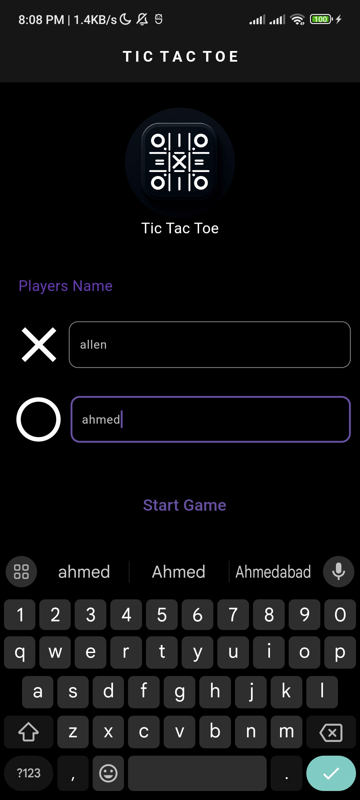

# Tic Tac Toe

## Description
Tic Tac Toe is a classic game built using Flutter 3.22.1. This app provides a simple and engaging way to play Tic Tac Toe on your mobile device. The project utilizes Flutter Version Management (FVM) to manage the Flutter SDK versions efficiently. The app also incorporates the Flutter Icon Launcher for customizing app icons.

## Screenshots & App Flow

  <a>1.<a>
  
  <a>2.<a>
  
  <a>3.<a>
  
  <a>4.<a>
  
  <a>5.<a>
  
  <a>6.<a>
  
  <a>7.<a>
  

## Installation
To install and run the app, follow these steps:
1. Clone the repository.
2. Ensure you have Flutter 3.22.1 installed. You can use FVM to manage the Flutter version (Fvm is advised).
3. Run `flutter pub get` or `fvm flutter pub get` to install dependencies.
4. Use `flutter run` or `fvm flutter run` to launch the app on your device or emulator.

## Usage
To play the game, simply launch the app and start a new game. Players take turns marking a square on the 3x3 grid. The first player to get three of their marks in a row (vertically, horizontally, or diagonally) wins the game. If all squares are filled and no player has three marks in a row, the game ends in a draw.

## Built With
- **Flutter 3.22.1**: The main framework used for building the app.
- **Flutter Icon Launcher**: Used for customizing app icons.
- **FVM (Flutter Version Management)**: Used for managing Flutter SDK versions.

## Contributing
Contributions are welcome! If you have any suggestions or improvements, please create a pull request or open an issue.

## Release
You can download the latest version of the APK from the link below:
- Download [Tic Tac Toe APK](https://github.com/saadrehman10/tic_tac_toe/releases/tag/1.2.0)

## Contact
For any questions or support, please contact me at [saadrehman264@gmail.com](saadrehman264@gmail.com). You can also message me on LinkedIn for any queries.
My LinkedIn is [itz-saad-ur-rehman](https://www.linkedin.com/in/itz-saad-ur-rehman/)
